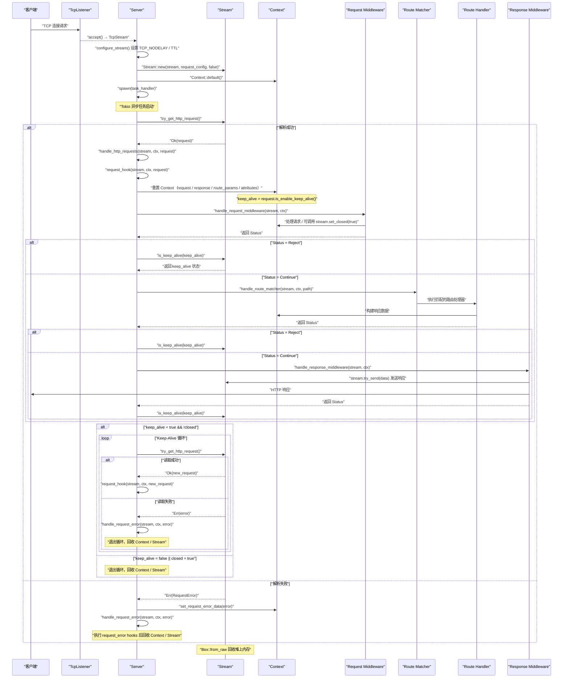

<!--
This file is auto-synced from the upstream docs-pages repo.
Manual edits will be overwritten on the next sync. To pin a custom version
of this reference, add "# manual override:" to its mapping line and the
script will leave it alone.
-->

<Share colorful />

> [!tip]
>
> `hyperlane` 框架时序图如下

<Bottom />
